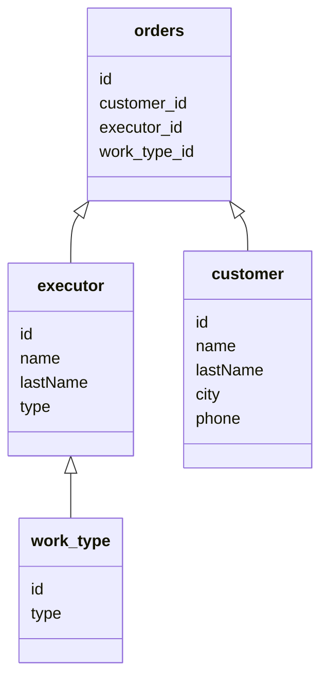

# SpringPracticeProject

Сделано просто для практики в использовании Spring boot, Spting data jpa.

Приложение позволяет создавать данные по заказу ремонтных работ.

Имеется 4 страницы:
 - Добавление клиента
 - Добавление исполнителя
 - Добавление заказа
 - Просмотр всех заказов


Главное меню:<br>
<br>
Добавление клиента:<br>
<br>
Добавление исполнителя:<br>
<br>
Добавление заказа:<br>
<br>
Просмотр заказов:<br>
<br>


Main.class
```Java
@SpringBootApplication
public class OrdersAppApplication {

	public static void main(String[] args) {
		SpringApplication.run(OrdersAppApplication.class, args);
	}

}
```

База данных:

