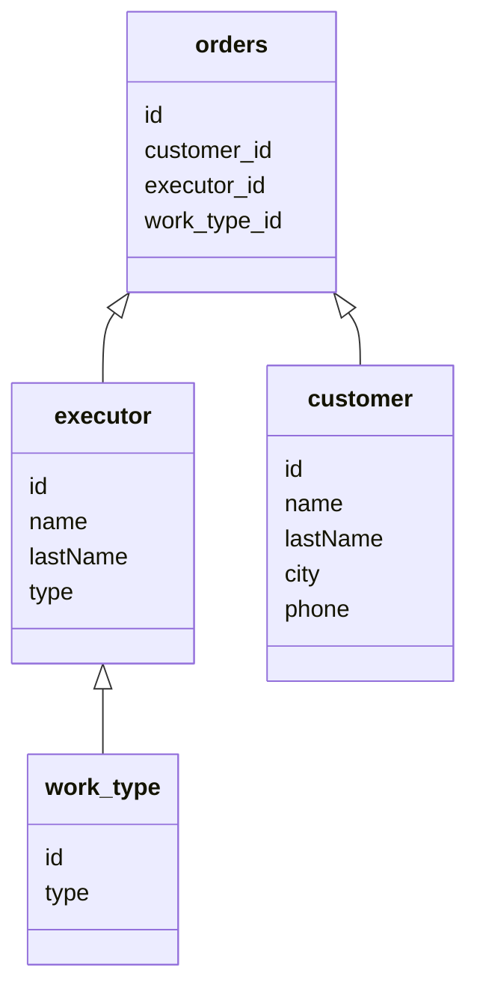

# SpringPracticeProject

Сделано просто для практики в использовании Spring boot, Spting data jpa.

Приложение позволяет создавать данные по заказу ремонтных работ.

Имеется 4 страницы:
 - Добавление клиента
 - Добавление исполнителя
 - Добавление заказа
 - Просмотр всех заказов

Главное меню:
[Главное меню][]
[Добавление клиента][]
[Добавление исполнителя][]
[Добавление заказа][]
[Просмотр заказов][]


Main.class
```Java
@SpringBootApplication
public class OrdersAppApplication {

	public static void main(String[] args) {
		SpringApplication.run(OrdersAppApplication.class, args);
	}

}
```

База данных:

